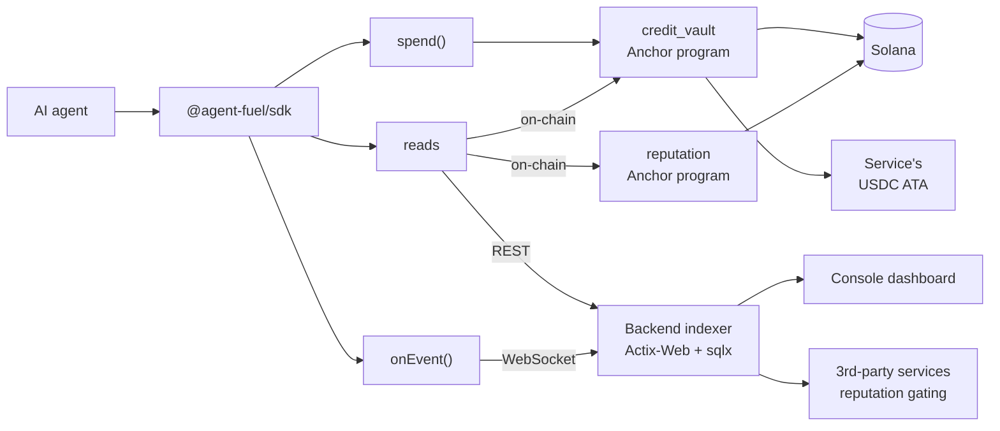

# Agent Fuel

**Credit-vault + reputation primitives for autonomous AI agents on Solana**

[](https://www.npmjs.com/package/@agent-fuel/sdk)   

---

## The Problem

AI agents that pay for services need three things humans take for granted but no Solana primitive provides: a **budget envelope** so a runaway loop can't drain a wallet, a **reputation signal** so services know who to extend post-pay credit to, and a **standard payment rail** so agents don't hardcode payment logic per endpoint. Today every team building autonomous agents on Solana either rolls these themselves or accepts the risk of an uncapped hot wallet.

## The Solution

```ts
import { Keypair, PublicKey } from "@solana/web3.js"
import { AgentFuel, paymentRequired } from "@agent-fuel/sdk"

const fuel = new AgentFuel({
  agent: Keypair.fromSecretKey(/* … */),
  owner: new PublicKey("…"),
  cluster: "devnet",
  rpc: "https://api.devnet.solana.com",
})

const fetchWithPayments = paymentRequired(fuel)
const res = await fetchWithPayments("https://data.example/feed")
// 402 → six-check policy guardrail → on-chain spend → retry with X-Payment → 200
```

Two Anchor programs enforce the policy on-chain. One SDK call abstracts the protocol. The agent's keypair signs every spend; the owner's keypair sets the budget; nobody else can override either.

---

## Architecture



The SDK is the only surface most developers touch. Programs hold the truth — every spend goes through the six-check policy ladder on chain. The backend mirrors program events for fast reads and a live WebSocket, and serves the public `/reputation/:agent` lookup that 3rd-party services use to gate post-pay credit.

---

## Live Devnet

| Artifact | Address / hash | Explorer |
|---|---|---|
| `reputation` program | `4GjB4xdm1VTPVM6KSiEEfJpD4u7BfY1qDx77StiFShvQ` | [view](https://explorer.solana.com/address/4GjB4xdm1VTPVM6KSiEEfJpD4u7BfY1qDx77StiFShvQ?cluster=devnet) |
| `credit_vault` program | `EsykPsafhHUeN7jA9DGqBiGuBsTBaFynLDVVpE4jFXDg` | [view](https://explorer.solana.com/address/EsykPsafhHUeN7jA9DGqBiGuBsTBaFynLDVVpE4jFXDg?cluster=devnet) |
| Sample vault (bootstrap) | `E8fMfr33XvT5KHn8kcoU9bw2uvJZV8JqHRHfr7rKQe2b` | [view](https://explorer.solana.com/address/E8fMfr33XvT5KHn8kcoU9bw2uvJZV8JqHRHfr7rKQe2b?cluster=devnet) |
| Sample service registry | `3PCx6TrxQ658Bh9JVNg2JtgtPcRANVfiZsYXmNRMNhgJ` | [view](https://explorer.solana.com/address/3PCx6TrxQ658Bh9JVNg2JtgtPcRANVfiZsYXmNRMNhgJ?cluster=devnet) |
| Live x402 spend | `3yb8QQ…1qkVe` | [view](https://explorer.solana.com/tx/3yb8QQ8PbGM8N9KAgTmNhoNirWvvgMSyqipDk87jUDdBuqD1UnRvqkZnP5zXf6SXfJZ17KPN25GFomni8391qkVe?cluster=devnet) |

The vault above was created via the bootstrap script, funded with 20 test-USDC, and then *paid 1 test-USDC to a registered service through the x402 protocol* — a real end-to-end demo verifiable on chain. Re-run it yourself:

```bash
cd clients/sdk
npm run build
npm run devnet:bootstrap      # idempotent: deploys mint, registers service, creates vault, deposits
cd examples/x402-quickstart
node server.mjs &             # x402 server demanding 1 test-USDC per /feed request
X402_REAL=1 node client.mjs   # agent pays, retries, succeeds
```

---

## Install

```bash
npm install @agent-fuel/sdk
```

Peer deps: `@solana/web3.js ^1.95`, `@coral-xyz/anchor ^0.31`. Node ≥ 18.18.

## The Six Functions

The entire SDK surface, mirroring the [landing page](clients/sdk/README.md):

| Function | Returns | What it does |
|---|---|---|
| `fuel.spend({ service, amountUsdc })` | `{ signature }` | Pays a service from the agent's vault. Local six-check policy guardrail (frozen / zero / whitelist / per-tx / hourly / lifetime) mirrors `programs/credit_vault/src/policy.rs`; on-chain `VaultError` codes map back to the same typed exceptions. Idempotently creates the service's USDC ATA if needed. |
| `fuel.getScore(agent?)` | `ReputationLookup` | Public reputation snapshot via REST. `null` for unscored agents. |
| `fuel.getVaultBalance(ref?)` | `CreditVaultAccount` | On-chain credit-vault state with a derived `balance` field. Defaults to the agent's own vault. |
| `fuel.getPolicy(ref?)` | `SpendPolicyAccount` | Per-tx / hourly / lifetime caps + whitelist + freeze flag. |
| `fuel.checkService(serviceAuthority)` | `ServiceRegistryAccount` | Registry lookup by the service's wallet pubkey. |
| `fuel.onEvent(callback, options?)` | `Subscription` | WebSocket stream of events for an agent. Reconnect with backoff (`1s → 2s → 4s … cap 30s`); status flow `connecting → open → reconnecting → closed`. Isomorphic: native WebSocket or `ws` package via lazy import. |

Plus one fetch wrapper for the x402 protocol — `paymentRequired(fuel, opts?)` returns a `fetch`-shaped function that transparently handles HTTP 402.

---

## Service Integration

Build an x402-paid endpoint with any HTTP framework. The server returns a 402 with a JSON payment requirement; the SDK on the agent side handles the rest. Reference server: [`clients/sdk/examples/x402-quickstart/server.mjs`](clients/sdk/examples/x402-quickstart/server.mjs) — pure Node, no dependencies. The protocol:

```http
GET /feed HTTP/1.1

HTTP/1.1 402 Payment Required
X-Payment-Required: {"recipient":"<service_authority_pubkey>","amountUsdc":1000000,"network":"solana-devnet"}
```

```http
GET /feed HTTP/1.1
X-Payment: <signature_from_spend>

HTTP/1.1 200 OK
…
```

Services that want to gate access by reputation can call `GET /reputation/:agent` on the backend (rate-limited, no auth) and decide whether to extend post-pay credit.

---

## Security Architecture

| Layer | Mechanism | Enforcement |
|---|---|---|
| Per-tx limit | `policy.per_tx_limit_usdc` check | On-chain `require!` in `check_and_record_spend` |
| Hourly rolling window | `policy.hourly_limit_usdc` over a 9 000-slot window | On-chain, with auto-reset |
| Lifetime ceiling | `policy.lifetime_limit_usdc` | On-chain |
| Whitelist | All-zero = unrestricted; otherwise recipient must match | On-chain `require!` |
| Freeze | Owner-only `freeze_vault` instruction | On-chain `require!(!vault.frozen)` |
| Owner / agent split | Owner deposits + sets policy; agent only signs spends | Anchor `has_one` + signer constraints |
| Service feedback | ERC-8004-compatible `give_feedback` with self-rating prevention | Service ≠ agent.owner ≠ agent.authority |
| Rate-limit on public reputation | 1 req/s per IP, burst 20 | `actix-governor` shared across workers |
| Constant-time webhook auth | `subtle::ct_eq` | Fail-closed when secret unset |
| WS hub backpressure | Bounded `tokio::mpsc` (256 slots), drop slow subscribers | Prevents OOM under hostile clients |
| Graceful shutdown | SIGINT/SIGTERM trap + 30s drain | Pair with `terminationGracePeriodSeconds ≥ 35` |

### Security Notice

The Anchor programs **have not been audited.** They have passing unit tests, LiteSVM slice tests, and a full Anchor integration suite, plus a live devnet deploy with the seven primary instructions exercised end-to-end via `clients/sdk/scripts/devnet-bootstrap.mjs`. Mainnet use should await a formal audit. Vulnerabilities: see [`SECURITY.md`](SECURITY.md) — please do not file public issues.

---

## Monorepo Structure

```
agent_fuel/
├── programs/
│   ├── reputation/                # AgentProfile + ServiceRegistry + FeedbackRecord PDAs
│   └── credit_vault/              # CreditVault + SpendPolicy PDAs + USDC ATA
├── backend/                       # Actix-Web indexer + REST + WS API (Railway-deployable)
│   ├── src/                       # Helius webhook → parser → mirror → score → WS broadcast
│   ├── migrations/                # sqlx Postgres migrations
│   └── Dockerfile                 # Multi-stage build, non-root, 165 MB image
├── clients/
│   ├── sdk/                       # @agent-fuel/sdk — npm
│   │   ├── src/                   # AgentFuel class, paymentRequired, PDA helpers, typed errors
│   │   ├── examples/x402-quickstart/  # Self-contained dry-run + real-devnet demo
│   │   └── scripts/devnet-bootstrap.mjs  # End-to-end devnet provisioning
│   └── web/                       # React + TS + Tailwind v4 dashboard (Vite)
├── tests/                         # TypeScript integration tests (Anchor)
├── railway.json                   # Tag-driven backend deploy
└── .github/workflows/             # SDK CI + tag-driven npm publish with provenance
```

---

## Capabilities

| Capability | Detail |
|---|---|
| Reputation primitive | `AgentProfile` + `FeedbackRecord` + `compute_score` over PRD §10.1 formula (volume × diversity × consistency, with active-negative-feedback penalty) |
| Credit vault | USDC-denominated PDA with six-check policy ladder, freeze, withdraw, post-pay claim |
| Backend ingest | Helius webhook → Anchor event decoder → Postgres mirror → 5-min score sweep + Redis cache (TTL 5 min) |
| Live event stream | `/ws/agents/:pubkey` per-agent WebSocket, exponential backoff in the SDK |
| Public reputation REST | `GET /reputation/:agent`, IP-rate-limited, distinguishes unscored from score=0 |
| SIWS auth | Sign-In-with-Solana for `/api/*` (1-hour JWT, nonce-bound replay protection) |
| x402 client | `paymentRequired(fuel)` wrapper — parses `X-Payment-Required`, fires `spend()`, retries with `X-Payment` |
| Typed error mapping | `VaultError` codes (6001–6006) bidirectionally mapped to `SpendPolicyError` subclasses — single catch handles pre-flight + on-chain rejections identically |
| Idempotent ATA-create | SDK auto-creates the service's USDC ATA before every spend (variant-1 idempotent instruction) |
| Devnet bootstrap | One command provisions mint + service + agent + vault + deposit, verified by SDK reads |
| Published with provenance | `@agent-fuel/sdk@0.1.0` on npm, Sigstore attestation via GitHub OIDC |

---

## Deployed

| Surface | Where | Status |
|---|---|---|
| `reputation` program | Solana devnet | [`4GjB4xdm…tiFShvQ`](https://explorer.solana.com/address/4GjB4xdm1VTPVM6KSiEEfJpD4u7BfY1qDx77StiFShvQ?cluster=devnet) |
| `credit_vault` program | Solana devnet | [`EsykPsaf…E4jFXDg`](https://explorer.solana.com/address/EsykPsafhHUeN7jA9DGqBiGuBsTBaFynLDVVpE4jFXDg?cluster=devnet) |
| `@agent-fuel/sdk` | npm | [`v0.1.0`](https://www.npmjs.com/package/@agent-fuel/sdk) |
| Backend (REST + WS + webhook) | Railway | [`api.agentfuel.online`](https://api.agentfuel.online/health/ready) |
| Console dashboard | local dev only | 4.W.10 (deploy) deferred |
| Flutter mobile | not started | 4.M deferred |
| Mainnet programs | not yet | Phase 5 |

---

## Phase Status

- ✅ **Phase 1** — Reputation program: seven instructions, ERC-8004 metadata, unit + slice tests
- ✅ **Phase 2** — Credit Vault program: vault + policy + six-check spend ladder + freeze/withdraw/claim
- ✅ **Phase 3** — Backend: Helius webhook ingest, parser, mirror tables, score engine, SIWS auth, REST + WS, FCM-ready alert dispatcher
- 🟡 **Phase 4** — Clients: SDK published; web dashboard local; mobile deferred; web deploy deferred until backend hardening shipped (✓ done) and frontend URL stabilises
- ⬜ **Phase 5** — Launch: audit + mainnet + partner agents + docs site

---

## Build & Test

Prerequisites: Rust (toolchain pinned in `rust-toolchain.toml`), Solana CLI ≥ 3.1, Anchor CLI ≥ 0.31, Node ≥ 18.18, Docker.

```bash
# Anchor programs
anchor build
cargo test --workspace
anchor test                       # full integration suite against solana-test-validator

# Backend (needs Postgres + Redis running locally — see CONTRIBUTING.md)
cargo run -p agent_fuel_backend

# SDK
cd clients/sdk
npm install
npm run build && npm run typecheck && npm run lint
npm run smoke                     # exercises the published surface

# Web console
cd clients/web
npm install && npm run dev        # http://localhost:5173
```

Devnet bootstrap walk-through: [`clients/sdk/examples/x402-quickstart/README.md`](clients/sdk/examples/x402-quickstart/README.md).

---

## License

Apache-2.0. See [`LICENSE`](LICENSE).

Built with support from the Solana Foundation. Design borrows from [SATI](https://github.com/cascade-protocol/sati) (Apache-2.0) for the ERC-8004-compatible feedback shape, and from the broader x402 ecosystem for the protocol pattern.
